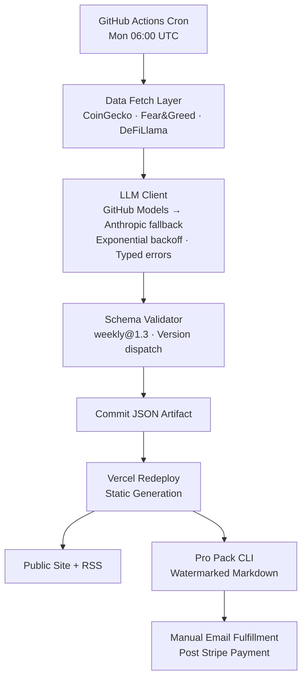

# Crypto Pulse

Weekly editorial reports on crypto markets, generated by an automated pipeline combining market-data APIs, an LLM agent flow, and a versioned artifact schema. Static-first, deploys to Vercel, runs every Monday at 06:00 UTC without human intervention.

**[Live site →](https://weekly-crypto-pulse.com)** · **[Latest report →](https://weekly-crypto-pulse.com/latest)**

> Source-available portfolio repository. The production system runs from a private fork; this repo demonstrates the engineering, schema design, and pipeline architecture.

---

## What it does

Every Monday at 06:00 UTC, a GitHub Actions cron triggers a multi-stage pipeline:

1. Fetches market data (CoinGecko top assets, dominance, snapshot; Alternative.me Fear & Greed; DeFiLlama TVL).
2. Calls an LLM (GitHub Models primary, Anthropic Claude fallback) to generate a structured weekly artifact.
3. Validates the artifact against a versioned JSON schema (`weekly@1.3`).
4. Commits the artifact to the repo and triggers a Vercel redeploy.
5. Site rebuilds; new report is live.

Free readers see reports on the site. Paid readers receive a watermarked Markdown deliverable by email after Stripe payment.

A daily pipeline (newsroom-handoff agent flow: researcher → writer → editor) shipped in R2.1, running on every weekday at 07:30 UTC.

## Architecture



**Key design choices:**

- **Static-first.** No runtime API calls during render. All pages pre-rendered at build time. Deliberate tradeoff: rules out subscription auth (no entitlement system possible at the edge) but gains zero infrastructure cost, instant global delivery, and trivial rollback via git.
- **No database.** Artifacts are committed JSON files. Git is the source of truth. Fine at current cadence; would need to change at ~daily-for-years scale, documented as a future migration trigger.
- **Multi-provider LLM with deliberate failover ordering.** Scripts don't pre-check credentials; missing-provider errors fall through to the secondary. Failing fast would be less resilient than failing through.

## Tech stack

| Layer | Choice |
|---|---|
| Runtime | Node.js · TypeScript 6.0.3 (strict) |
| Framework | Next.js 16 (App Router) |
| Styling | Tailwind CSS v4 |
| LLM client | openai SDK with custom provider abstraction |
| LLM providers | GitHub Models (primary, gpt-4o-mini), Anthropic Claude Sonnet 4.6 (fallback) |
| Charting | Recharts v3 (client) + `sharp` (build-time PNG export) |
| Scheduling | GitHub Actions cron |
| Hosting | Vercel (static) |
| Payments | Stripe Payment Links |
| Testing | Vitest (552 unit + integration tests) + Playwright (E2E smoke) |
| CI security | CodeQL SAST, Dependabot, `npm audit` gate |

## What's interesting in this codebase

If you're reading this to evaluate the work, these are the parts that took real iteration and represent the non-trivial decisions.

### Versioned artifact schema with version-dispatched validation

`lib/reports/artifact-validator.ts` ships `weekly@1.3` and `daily@1.2`. Validator dispatches per-version. Legacy `1.0` artifacts remain valid forever — the alternative is forced archive migrations every time the schema moves.

### Discriminated-union repository over heterogeneous artifacts

`lib/reports/artifact-repository.ts` returns weekly + daily as one chronological stream while keeping the schemas separate. The discriminator is computed from `schemaVersion` at load time, not stored in the JSON, to prevent the file and the discriminator drifting.

### Newsroom-handoff agent flow over multi-agent debate

The daily pipeline is `researcher → writer → editor` with up to two revision rounds before auto-approve. Multi-agent debate was considered and rejected: when agents share a model and context, debate produces longer logs without measurably better output. The researcher/writer/editor split solves a different problem — separation of concerns (find facts vs. compose prose vs. enforce voice) — and that one is real.

### LLM client with typed errors and provider failover

`lib/llm/` exposes a typed request/response surface. Errors are a discriminated union with a `kind` tag (`rate_limit`, `auth`, `transient`, `schema`, `unknown`). Retryable errors trigger exponential backoff (60s/180s/540s). Non-retryable errors fall through to the secondary provider, with the failed-provider context chained into the secondary's error.

### CSP honesty

Next.js requires `'unsafe-inline' 'unsafe-eval'` in `script-src` for hydration. A nonce-based CSP would require server rendering, which contradicts static-first. Rather than claiming a CSP we don't have, the security baseline documents the tradeoff explicitly and the mitigations applied (HSTS, frame-ancestors, etc.). See `docs/security.md`.

### Next 14 → 16 upgrade during R2.1

The R2.0 security pass surfaced five high-severity CVEs against Next 14. Rather than silently force-fixing through a major version upgrade mid-release, this was deferred to R2.1 with a documented risk acceptance and the `npm audit` gate was temporarily lowered from `high` to `critical`. The upgrade completed in R2.1.1 as part of the Dependabot backlog cleanup.

## What's not in this repo

**Production deployment configuration.** The live site runs from a private fork with production-only secrets and configuration. This public repo is a clean source tree for inspection.

## Local development

```bash
git clone https://github.com/castanhf/Weekly-Crypto-Pulse.git
cd Weekly-Crypto-Pulse

npm ci

cp .env.example .env.local
# Edit .env.local — at minimum, set GITHUB_TOKEN for LLM testing

npm run dev
# Open http://localhost:3000

npm test          # Vitest unit
npm run test:e2e  # Playwright smoke
```

## Roadmap

- **R1.1** — Weekly pipeline, static site, RSS, Pro Pack ✅
- **R2.0** — Security baseline, schema versioning, daily-pipeline scaffolding ✅
- **R2.1** — Daily pipeline activation, charts, Beehiiv email distribution, Next 16 upgrade ✅
- **R2.2** — Reader-visible improvements *(planned)*
- **R3** — Substack-style email Pro tier via Stripe Customer Portal *(under consideration)*

## License

Source-available under [AGPL-3.0](LICENSE). Modifying and running this code as a hosted service requires publishing modifications under the same license. For commercial licensing without AGPL obligations, contact filcastanheiradev@gmail.com.

---

Built by Filipe Castanheira · [LinkedIn](https://www.linkedin.com/in/castanhf/) · https://weekly-crypto-pulse.com
